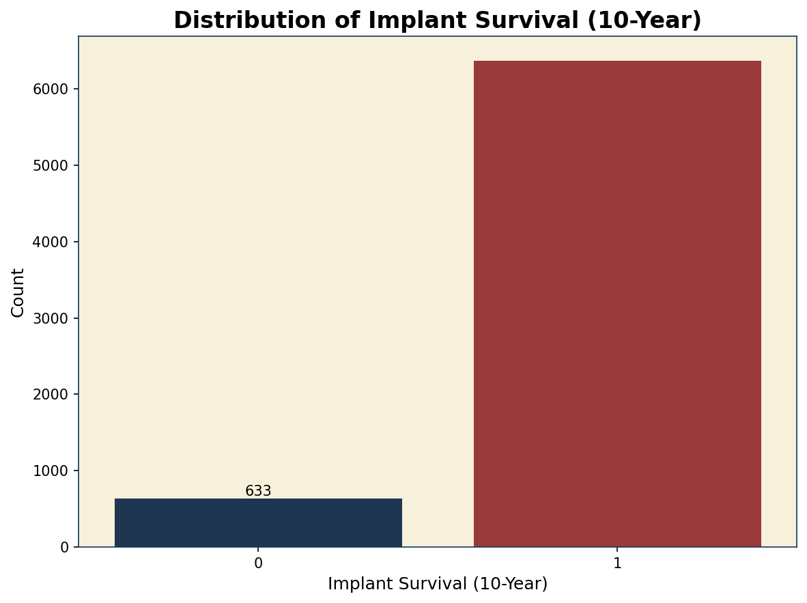
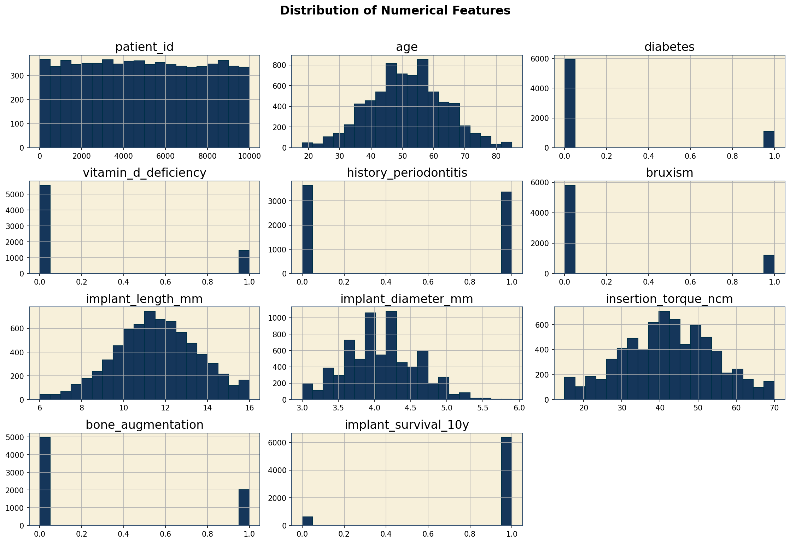
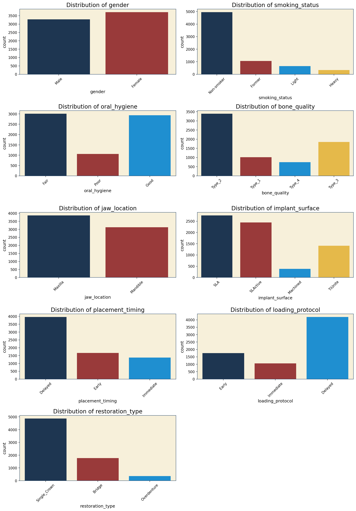
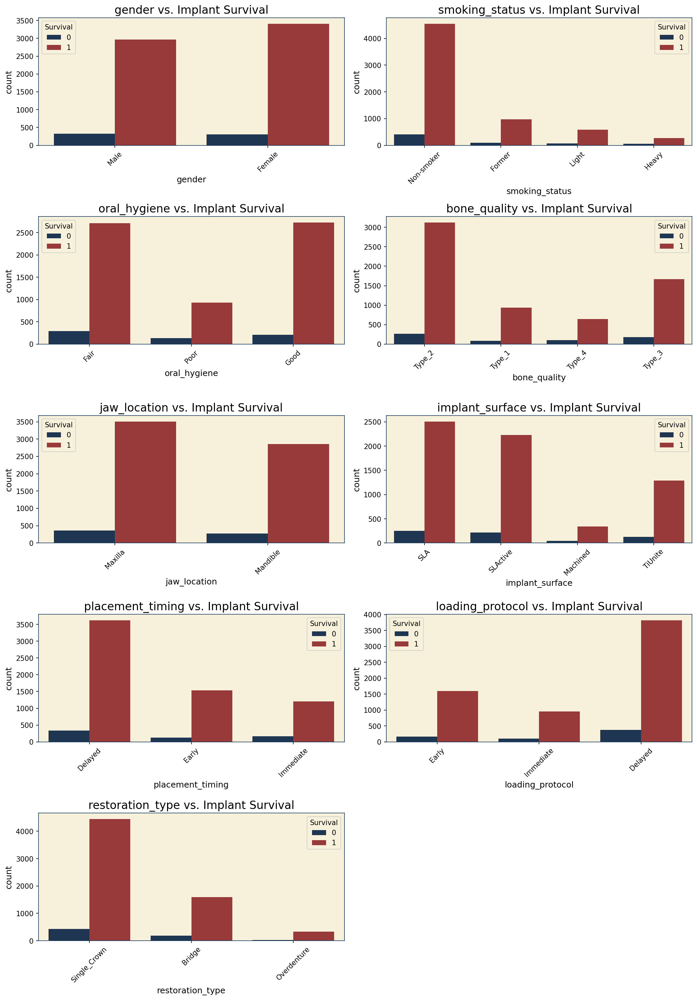
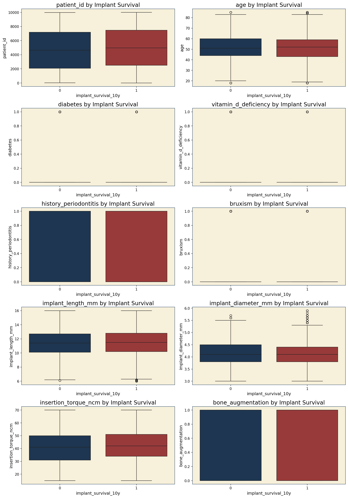
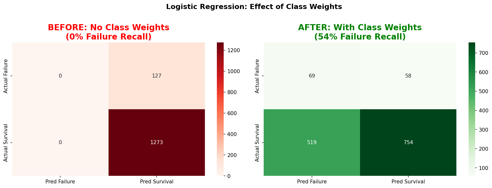
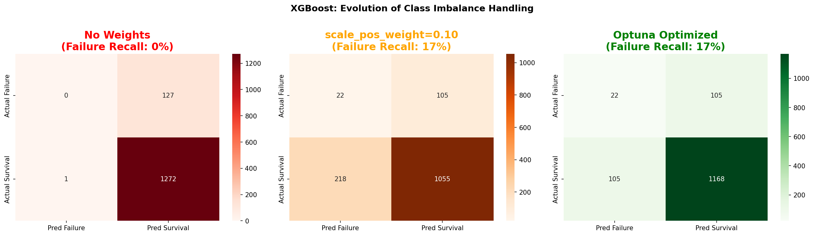
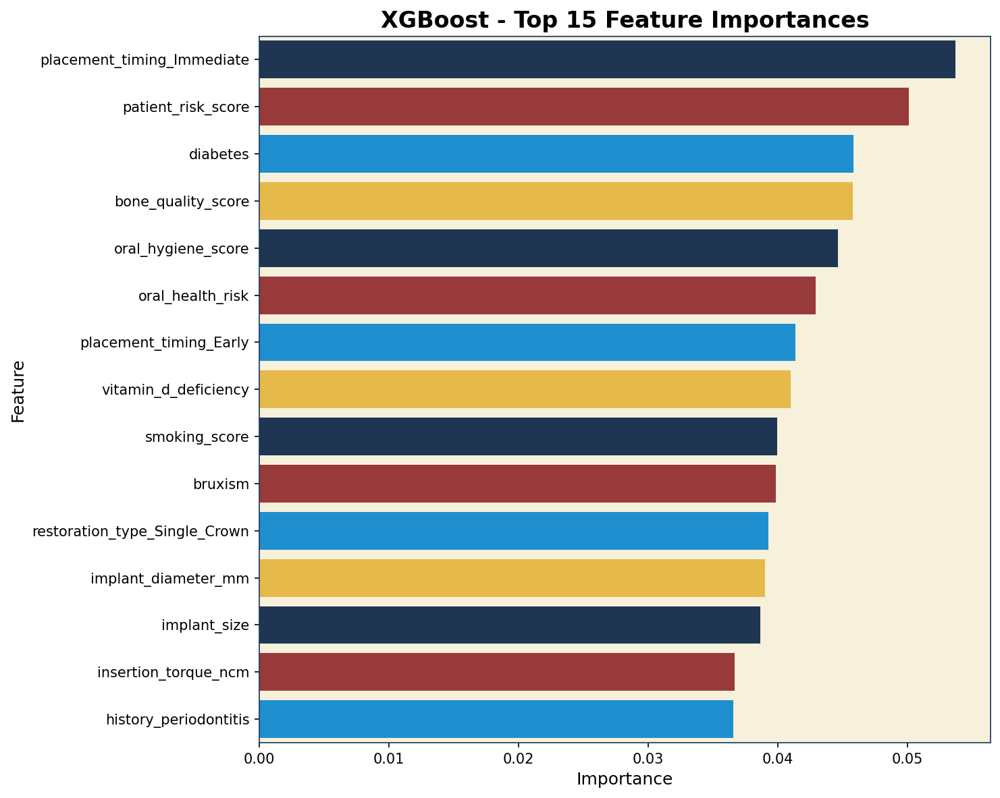

# 🦷 Dental Implant 10-Year Survival Prediction

<div align="center">


**A comprehensive machine learning walkthrough for predicting dental implant survival outcomes**

[🎯 Overview](#-project-overview) • [📊 Workflow](#-workflow) • [🚀 Setup](#-setup) • [📦 Submission](#-submission)

</div>

> Educational Kaggle competition project with guided TODOs and hints to learn ML fundamentals step-by-step.

---

## 👨‍💻 Author

<div align="center">

**Francisco Teixeira Barbosa**

[](https://github.com/Tuminha)
[](https://www.kaggle.com/franciscotbarbosa)
[](mailto:cisco@periospot.com)
[](https://twitter.com/cisco_research)

*Learning Machine Learning through hands-on Kaggle competitions • Building AI solutions for dentistry*

</div>

---

## 🎯 Project Overview

This project is a comprehensive walkthrough for the Kaggle competition "Dental Implant 10-Year Survival Prediction". It aims to build and evaluate several machine learning models to predict the 10-year survival of dental implants based on clinical and patient data.

### 🎓 Learning Objectives

- Understand the complete ML workflow from EDA to submission
- Master data preprocessing and feature engineering techniques
- Compare baseline models with advanced gradient boosting methods
- Learn best practices for Kaggle competitions

### 🏆 Key Achievements

- [x] Complete exploratory data analysis with visualizations ✅
- [x] Data preprocessing with feature engineering ✅
- [x] Baseline models with class imbalance handling ✅
- [x] XGBoost with Optuna hyperparameter tuning ✅
- [x] LightGBM with Optuna hyperparameter tuning ✅
- [ ] CatBoost model
- [ ] Generate valid Kaggle submission

---

## 📊 EDA Insights & Visualizations

### Dataset Overview

| Attribute | Value |
|-----------|-------|
| **Samples** | 7,000 implant cases |
| **Features** | 19 predictive features + 1 target |
| **Missing Values** | None ✅ |
| **Target Variable** | `implant_survival_10y` (binary) |

### ⚠️ Class Imbalance

<div align="center">



</div>

The dataset is **highly imbalanced**:
- **Survival (1):** 90.96% (6,367 cases)
- **Failure (0):** 9.04% (633 cases)

This mirrors real-world implant success rates but requires careful handling in modeling (class weights, SMOTE, appropriate metrics).

### Feature Distributions

<div align="center">



*Distribution of numerical features including age, implant dimensions, and insertion torque*

</div>

<div align="center">



*Distribution of categorical features: gender, smoking status, oral hygiene, bone quality, and more*

</div>

### Feature Correlations

<div align="center">


*Correlation matrix showing weak linear relationships between numerical features and target*

</div>

**Key Finding:** All numerical correlations with the target are weak (|r| < 0.1), suggesting:
- No single feature is a strong linear predictor
- Tree-based models may capture non-linear patterns better
- Categorical features and feature interactions are likely important

### Features vs. Target

<div align="center">



*Relationship between categorical features and implant survival outcome*

</div>

<div align="center">



*Box plots comparing numerical feature distributions across survival outcomes*

</div>

---

## 🔧 Data Preprocessing & Feature Engineering

### Preprocessing Pipeline

The data preprocessing notebook (`02_Data_Preprocessing.ipynb`) transforms raw data into model-ready features:

| Step | Description |
|------|-------------|
| **1. Load Data** | Load train.csv (7,000 rows) and test.csv (3,000 rows) |
| **2. Drop ID** | Remove `patient_id` (not predictive) |
| **3. Feature Engineering** | Create 7 new clinically-informed features |
| **4. Encode Categoricals** | Binary encoding + One-hot encoding |
| **5. Save Processed Data** | Export to `/data/processed/` for modeling |

### 🧬 Engineered Features

We created 7 new features based on clinical domain knowledge:

| Feature | Formula | Clinical Rationale |
|---------|---------|-------------------|
| `age_group` | Binned: young_adult, middle_age, senior, elderly | Healing capacity differs across life stages |
| `patient_risk_score` | diabetes + vitamin_d_deficiency + bruxism | Combined systemic risk factors (0-3) |
| `oral_hygiene_score` | Poor=0, Fair=1, Good=2 | Ordinal encoding for local oral health |
| `oral_health_risk` | periodontitis + (2 - hygiene_score) | Combined local risk factors (0-3) |
| `implant_size` | length_mm × diameter_mm | Surface area for osseointegration |
| `bone_quality_score` | Type_1=3, Type_2=2, Type_3=1, Type_4=0 | Ordinal encoding (higher = better bone) |
| `smoking_score` | Non-smoker=0, Former=1, Light=2, Heavy=3 | Dose-response effect on healing |

### 📁 Processed Data Output

```
/data/processed/
├── X_train.csv      # Training features (7,000 × 38 features)
├── y_train.csv      # Training target labels
├── X_test.csv       # Test features (3,000 × 38 features)
├── test_ids.csv     # Patient IDs for submission
└── feature_names.csv # List of all feature names
```

**Key Insight:** The original 18 raw features expanded to **27 features** after:
- 7 engineered features added
- Ordinal encoding for ordered categories (smoking, oral hygiene, bone quality)
- One-hot encoding for nominal categories

---

## 🤖 Baseline Models Results

### The Class Imbalance Challenge

With 91% survival vs 9% failure, naive models predict "everyone survives" achieving 91% accuracy but **0% failure detection** — clinically useless!

**Solution:** Use `class_weight='balanced'` to penalize errors on minority class.

### Model Comparison

| Model | ROC-AUC | Accuracy | Recall (Failure) | Recall (Survival) |
|-------|---------|----------|------------------|-------------------|
| Logistic Regression (no weights) | 0.610 | 90.9% | **0%** ❌ | 100% |
| **Logistic Regression (balanced)** | 0.611 | 58.8% | **54.3%** ✅ | 59.2% |
| Random Forest (no weights) | 0.573 | 90.9% | **0%** ❌ | 100% |
| Random Forest (balanced) | 0.578 | 89.3% | **2.4%** | 98.0% |

### Key Insight: The Accuracy Trap

<div align="center">



*Left: Without class weights (0% failure recall). Right: With class weights (54% failure recall)*

</div>

**Logistic Regression (balanced)** is the current best model:
- Detects 54% of at-risk implants (69 out of 127 failures)
- Trade-off: More false positives (519 survivals flagged as at-risk)
- Clinically meaningful: Better to over-monitor than miss failures!

### Lessons Learned
1. **Accuracy is misleading** for imbalanced data
2. **Class weights** are essential for minority class detection
3. **Recall per class** is more informative than overall accuracy
4. Simple Logistic Regression outperformed Random Forest on this task

---

## 🚀 XGBoost with Optuna Tuning

### Class Imbalance Handling in XGBoost

XGBoost uses `scale_pos_weight` parameter to handle class imbalance. We tested three approaches:

| Model | ROC-AUC | F1 (Macro) | Recall (Failure) | Recall (Survival) |
|-------|---------|------------|------------------|-------------------|
| XGBoost (no weights) | 0.571 | 0.480 | **0%** ❌ | 100% |
| XGBoost (scale_pos_weight) | 0.611 | 0.491 | **17%** | 83% |
| **XGBoost (Optuna)** | 0.600 | 0.545 | **17.3%** ✅ | 91.8% |

### Optuna Hyperparameter Tuning

We ran **50 trials** optimizing F1 (Macro) score with 3-fold cross-validation.

**Best Parameters Found:**
- `n_estimators`: 80
- `max_depth`: 9
- `learning_rate`: 0.231
- `scale_pos_weight`: 0.163
- `gamma`: 4.60

<div align="center">



*Left: No weights (0% failure recall). Middle: Manual scale_pos_weight. Right: Optuna optimized*

</div>

### XGBoost Feature Importance

<div align="center">



*Top features identified by XGBoost: implant_size, age, insertion_torque, implant dimensions*

</div>

---

## 📂 Project Structure

```
/dental-implant-prediction
├── data/
│   ├── raw/                    # Original, immutable data from Kaggle
│   │   ├── train.csv
│   │   ├── test.csv
│   │   └── sample_submission.csv
│   └── processed/              # Cleaned and preprocessed data
├── notebooks/
│   ├── 01_EDA.ipynb                    # Exploratory Data Analysis
│   ├── 02_Data_Preprocessing.ipynb     # Data cleaning & feature engineering
│   ├── 03_Baseline_Models.ipynb        # Logistic Regression & Random Forest
│   ├── 04_XGBoost.ipynb                # XGBoost model
│   ├── 05_LightGBM.ipynb               # LightGBM model
│   ├── 06_CatBoost.ipynb               # CatBoost model
│   └── 07_Submission_Generation.ipynb  # Final submission generation
├── results/                    # Model evaluation metrics (JSON)
├── figures/                    # Plots and visualizations
├── .gitignore
└── README.md
```

---

## 📊 Workflow

1. **Exploratory Data Analysis (EDA):** Start with `01_EDA.ipynb` to understand the data distributions, correlations, and patterns.

2. **Data Preprocessing:** Run `02_Data_Preprocessing.ipynb` to clean the data, handle categorical features, and prepare it for modeling.

3. **Model Training:** Run the model-specific notebooks (`03` to `06`) to train and evaluate different classifiers:
   - `03_Baseline_Models.ipynb` - Logistic Regression & Random Forest
   - `04_XGBoost.ipynb` - Extreme Gradient Boosting
   - `05_LightGBM.ipynb` - Light Gradient Boosting Machine
   - `06_CatBoost.ipynb` - Categorical Boosting

4. **Submission:** Use `07_Submission_Generation.ipynb` to generate the final `submission.csv` file.

---

## 🚀 Setup

### Prerequisites

```bash
pip install pandas numpy matplotlib seaborn scikit-learn jupyter xgboost lightgbm catboost
```

### Getting Started

1. Clone this repository:
   ```bash
   git clone <repository-url>
   cd dental-implant-prediction
   ```

2. Download the data from the [Kaggle competition page](https://www.kaggle.com/competitions/dental-implant-10-year-survival-prediction/data) and place the files in the `/data/raw/` folder.

3. Create a Python virtual environment (recommended):
   ```bash
   python -m venv venv
   source venv/bin/activate  # On Windows: venv\Scripts\activate
   pip install -r requirements.txt
   ```

4. Launch Jupyter and start with the first notebook:
   ```bash
   jupyter notebook notebooks/01_EDA.ipynb
   ```

---

## 🛠 Technical Stack

| Component | Technology | Purpose |
|-----------|------------|---------|
| Data Processing | Pandas, NumPy | ETL & feature engineering |
| Visualization | Matplotlib, Seaborn | EDA & plots |
| Baseline ML | Scikit-learn | LogReg, Random Forest |
| Gradient Boosting | XGBoost, LightGBM, CatBoost | Advanced models |
| Evaluation | Scikit-learn | ROC-AUC, Accuracy, Confusion Matrix |

---

## 📦 Submission

After completing all notebooks:

1. The best model will be trained on the full dataset in `07_Submission_Generation.ipynb`
2. Predictions will be generated for the test set
3. A `submission.csv` file will be created ready for Kaggle upload

### Upload to Kaggle

**Via UI:** Go to Kaggle → Competition → Submit Predictions → Upload `submission.csv`

**Via CLI:**
```bash
kaggle competitions submit -c dental-implant-10-year-survival-prediction -f submission.csv -m "Your submission message"
```

---

## 📝 Learning Journey

This project covers:
- **EDA Skills:** Data visualization, distribution analysis, correlation studies
- **Preprocessing:** Handling categorical data, one-hot encoding, train-test splitting
- **Model Training:** From simple baselines to gradient boosting ensembles
- **Evaluation:** ROC-AUC, accuracy, confusion matrices, model comparison

---

## 🚀 Next Steps

- [ ] Hyperparameter tuning with GridSearchCV/Optuna
- [ ] Feature importance analysis with SHAP
- [ ] Ensemble methods (stacking, blending)
- [ ] Cross-validation strategies

---

## 📄 License

MIT License (see [LICENSE](LICENSE))

<div align="center">

**⭐ Star this repo if you found it helpful! ⭐**

*Building AI solutions for dentistry, one dataset at a time* 🦷

</div>

